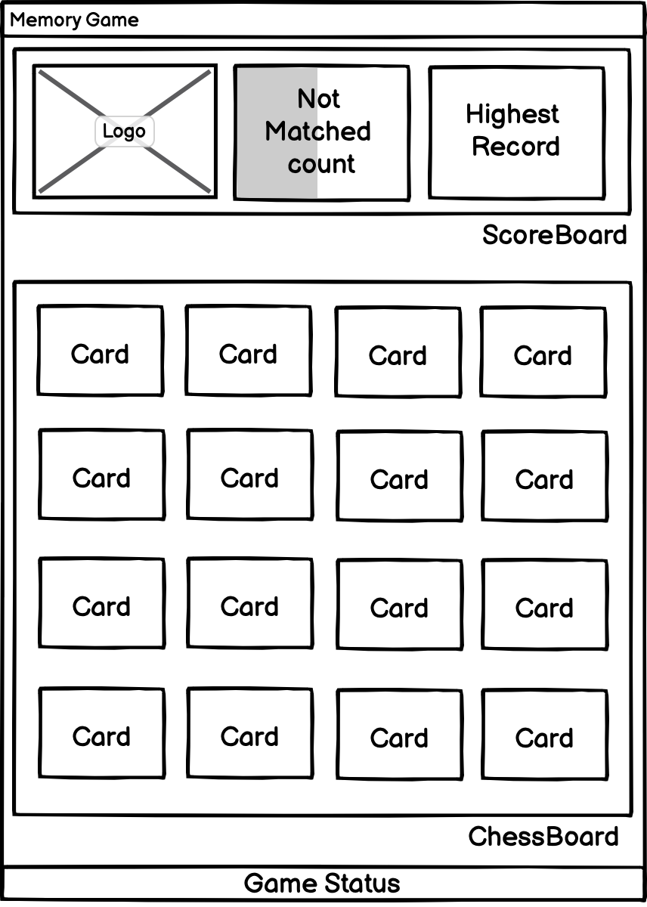

# rust-memory-game

![][david-url]
![][license-url]

A tiny game written in `rust`(compile to wasm). It's inspired by IgorMinar's [Memory-Game](https://github.com/IgorMinar/Memory-Game). You can view the online demo [here](http://leftstick.github.io/rust-memory-game).

> If you are looking for `angular5` version, check it [here](https://github.com/leftstick/angular5-memory-game)

> If you are looking for `react` version, check it [here](https://github.com/leftstick/react-memory-game)

> If you are looking for `vue3` version, check it [here](https://github.com/leftstick/vue-memory-game)

[trunk](https://trunkrs.dev/) is involved as dev tool here.

## Components Tree



## Components break down

1. `main`, the whole game board
2. `score_board`, the panel on the top, including "Logo", "Progress", "Highest Record"
3. `score_board_logo`, on the left of `score_board`, showing the game Logo
4. `score_board_progress`, on the center of `score_board`, showing the current matching information
5. `score_board_best_score`, on the right of `score_board`, showing the best result
6. `chess_board_card`, each card in the playground
7. `game_status_board`, the footer part, displaying current status of game

## File Structure

```
vue-memory-game
├── public
|   ├── 8-ball.png
|   ├── ...
|   └── zeppelin.png
├── src
│   ├── components
│   │   ├── chess_board_card.rs
│   │   ├── game_status_board.rs
│   │   ├── score_board_best_score.rs
│   │   ├── score_board_logo.rs
│   │   ├── score_board_progress.rs
│   │   └── score_board.rs
│   │
│   ├── components.rs
│   ├── constant.rs
│   ├── helper.rs
│   ├── main.rs
│   └── state.ts
│
├── Cargo.toml
├── index.html
├── index.scss
├── package.json
└── README.md
```

## Want Having a try locally?

### Running Environment

- [rust](https://www.rust-lang.org/), version `>=1.56`
- [trunk](https://trunkrs.dev/), version `>=0.14`

### Recommended Editor

- [visual studio code](https://code.visualstudio.com/)

```bash
#cloning code
git clone https://github.com/leftstick/rust-memory-game.git
cd rust-memory-game

// start local web server
trunk serve
```

Now, view the demo at [http://localhost:8080](http://localhost:8080)

## LICENSE

[MIT License](https://raw.githubusercontent.com/leftstick/rust-memory-game/master/LICENSE)

[david-url]: https://david-dm.org/leftstick/rust-memory-game.png
[license-url]: https://img.shields.io/github/license/leftstick/rust-memory-game.svg
